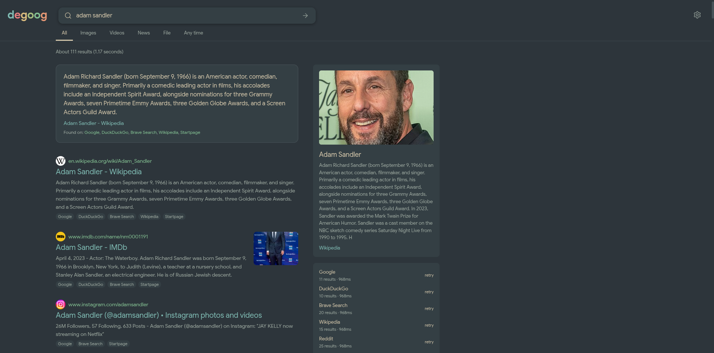
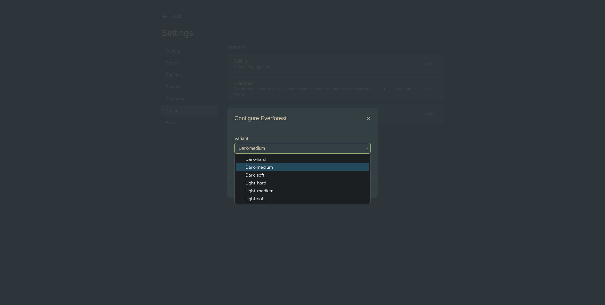
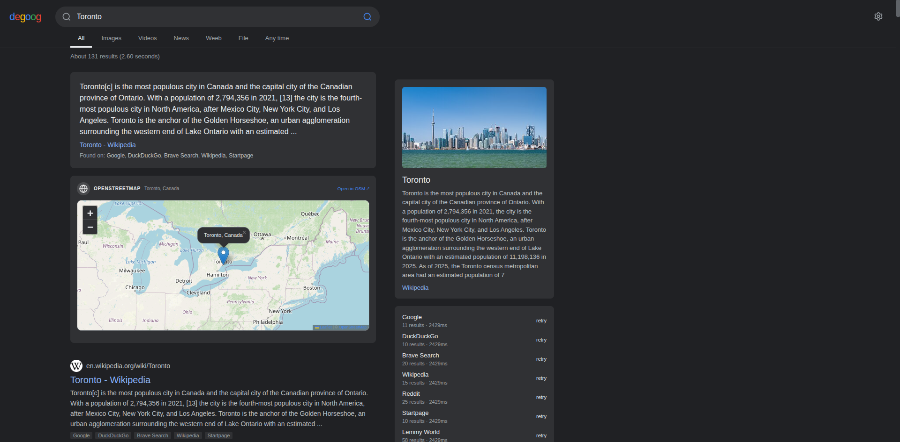
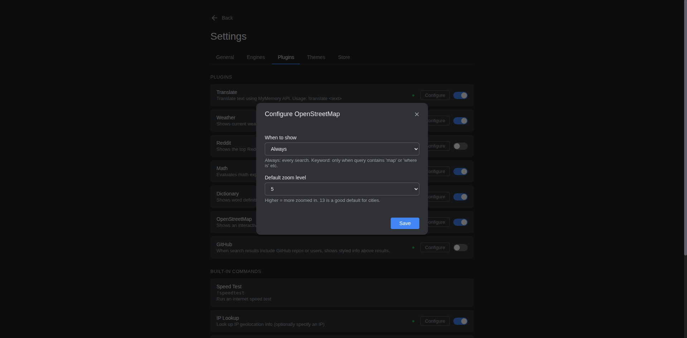
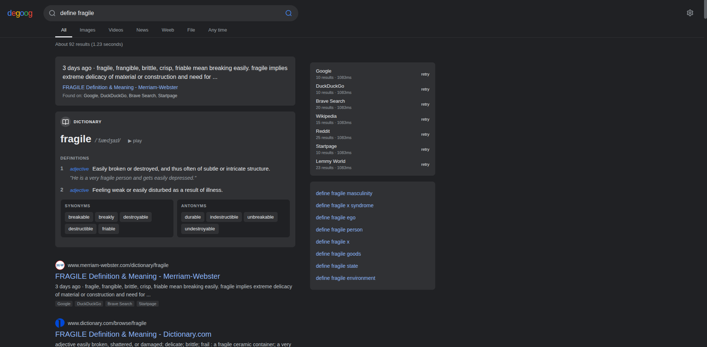
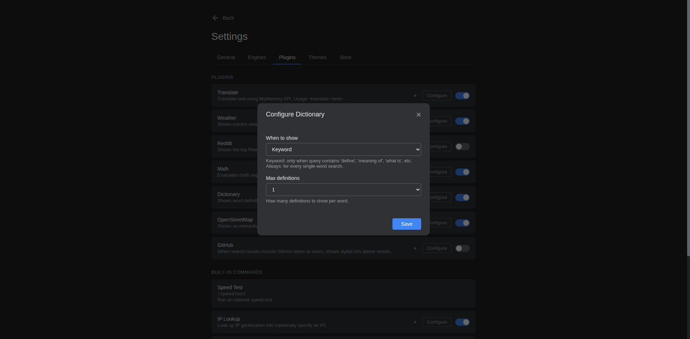

<h1 align="center">Georgvwt's degoog stuff</h1>

  Random themes & plugins for <a href="https://github.com/fccview/degoog">degoog</a>.

---

Themes

### Everforest

  

Warm green forest palette inspired by [sainnhe/everforest](https://github.com/sainnhe/everforest). Available in 6 variants: Dark Hard, Dark Medium, Dark Soft, Light Hard, Light Medium, Light Soft.

Screenshots

---

Plugins

### Reddit Answers

Shows top comments from Reddit threads above search results. When a search result includes a Reddit link, the plugin fetches and displays the highest-voted replies in a card above the results.

Screenshots

### OpenStreetMap

Shows an interactive map above search results for location-related queries. Uses Nominatim geocoding and Leaflet — no API key required.

Screenshots

### Dictionary

Shows word definitions, pronunciation, synonyms, antonyms and etymology above search results. Uses the Free Dictionary API — no API key required. Trigger with queries like `define ephemeral` or `meaning of fleeting`.

Screenshots

