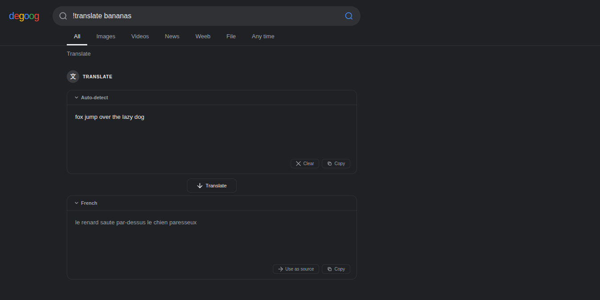
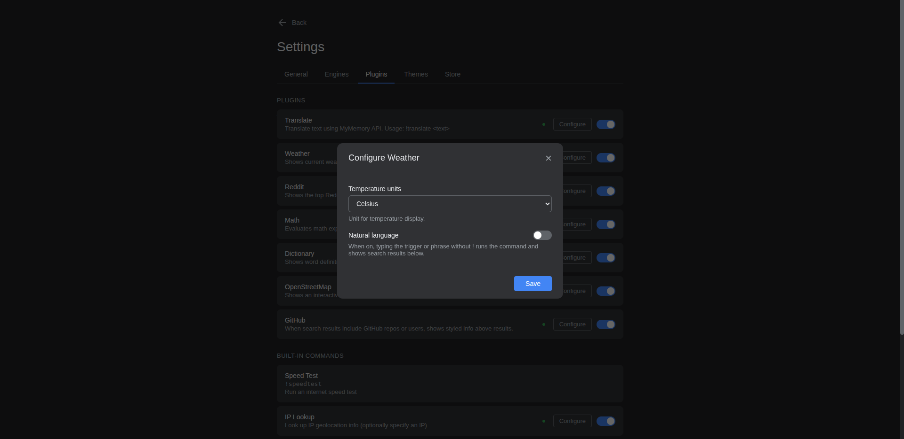
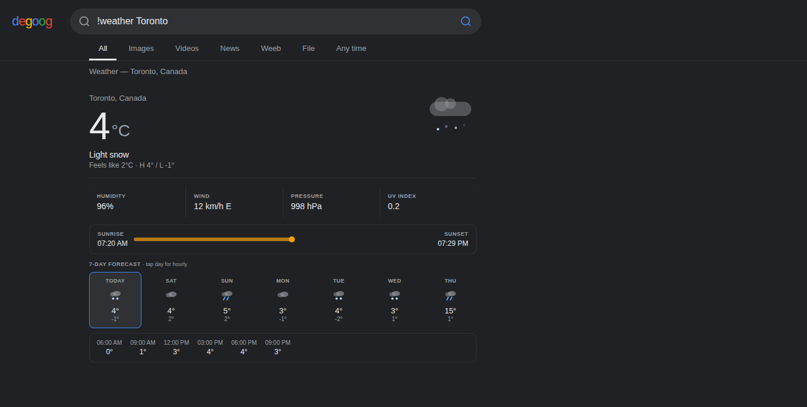
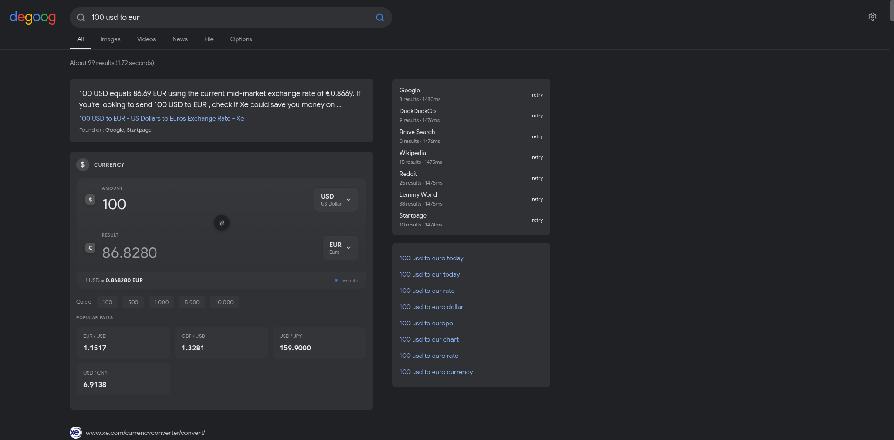
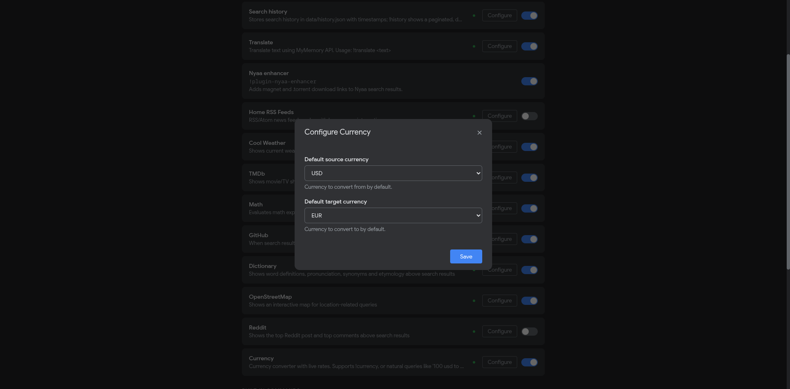

<h1 align="center">THIS REPO IS ABANDONED</h1>

  My repo is moving to the <a href="https://codeberg.org/Georgvwt/georgvwt-degoog-stuff">codeberg</a>.

---

Themes

### Everforest

  

Warm green forest palette inspired by [sainnhe/everforest](https://github.com/sainnhe/everforest). Available in 6 variants: Dark Hard, Dark Medium, Dark Soft, Light Hard, Light Medium, Light Soft.

Screenshots

---

Plugins

### Reddit Answers

Shows top comments from Reddit threads above search results. When a search result includes a Reddit link, the plugin fetches and displays the highest-voted replies in a card above the results.

Screenshots

### OpenStreetMap

Shows an interactive map above search results for location-related queries. Uses Nominatim geocoding and Leaflet — no API key required.

Screenshots

### Dictionary

Shows word definitions, pronunciation, synonyms, antonyms `(you can click on them and see their definition, may not work if you are using http instead of https on phone)` and etymology above search results. Uses the Free Dictionary API — no API key required. Trigger with queries like `define ephemeral` or `meaning of fleeting`.

Screenshots

### Translate

Bang command that translates text using the MyMemory API — no API key required. Use !translate <text> to translate, with auto-detection of the source language. For single-word translations, a side panel appears with audio pronunciation, usage examples, and synonyms for both languages. May be buggy.
Usage: `!translate hello`, `!translate hello to:fr`

Screenshots

### Cool Weather

Bang command that shows current weather and a 7-day forecast for any city. Uses Nominatim for geocoding and Open-Meteo for weather data — no API key required. Features cool animated weather icons, hourly breakdown on tap, and a sunrise/sunset progress bar.
Usage: `!weather New York`, `!weather Tokyo`

Screenshots

### Currency

Currency converter with live exchange rates. Supports natural language queries like `100 usd to eur`, `50 dollars in euros`, or bang command `!currency 100 USD EUR`. Features interactive currency picker, quick amount buttons, popular pairs grid, and smooth animations. Uses Frankfurter API for fiat currencies and CoinGecko for crypto (BTC, ETH) — no API key required.

Screenshots

